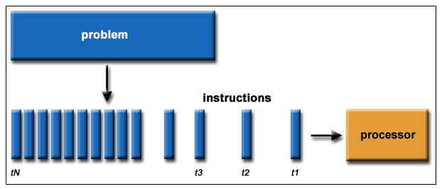
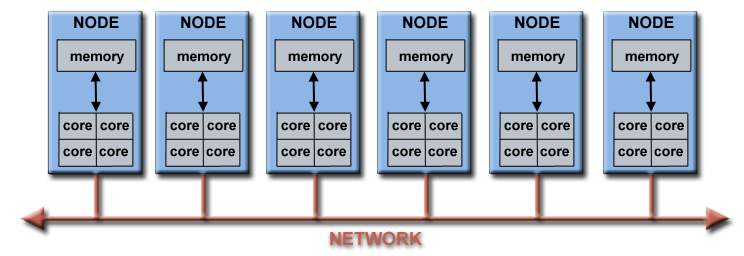
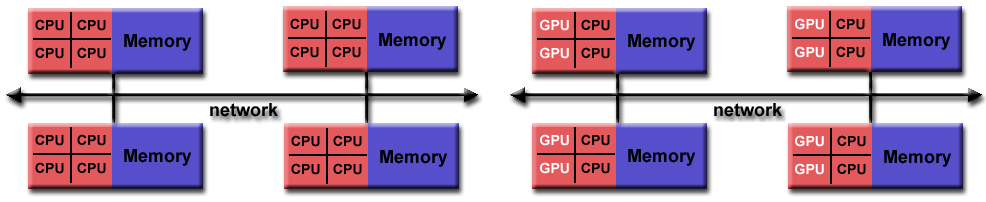

# **Concurrent Programming**
## The fun part

https://talks.obedmr.com/


---

## Concurrent vs Parallel


---

## Serial Computing

- A problem is broken into a serie of instructions
- Instructions are executed sequentially
- Instructions are executed in a single processor
- Only one instructions at the time




---

## Parallel Computing

- A problem is broken into a parts that can be solved concurrently
- Each part is broken to a serie of instructions
- Instructions from each part are executed simultaneously on different processors
- A control/synchronization mechanism is required


---

## Parallel Computers
### Standalone Computers
- Multiple functional units (Lx Caches, prefetch, decode, floating point, GPU and more)
- Multiple execution units/cores
- Multiple hardware threads


---

## Parallel Computers
### Multiple standalone computers
To make a larger parallel computer(cluster).




---

## Where is being used all this?


---

## Why concurrent/parallel computing?

- Save time and money.
- Performance.
- Solve larger and more complex problems.
- Provide concurrency.
- Take advantage of non-local resources.
- Better use of underlying parallel hardware.
- What else?


---

## Jargon of Parallel Programming

### Von Neumann Architecture


**So, what? Who cares?**
Parallel computers still follow this basic design, just multiplied in units. The basic, fundamental architecture remains the same.


---

## Some extra terms

- **Task** - as a sequence of instructions to solve a particular problem
- **Unit of execution (UE)** - a task needs to be mapped to a UE such as a process or thread
- **Processing element (PE)** - as a generic term for a hardware element that executes a stream of instructions
```
- Load balancer and load balancing
- Synchronization
- Synchronus vs Asynchronus
- Race Conditions
- Deadlocks
- Granularity
- Scalability
```


---

## Flynn's Taxonomy

Distinguishes multi-processor computer architectures according to how they can be classified along the two independent dimensions of **Instruction Stream** and **Data Stream**.

Each of these dimensions can have only one of two possible states: **Single** or **Multiple**.


---

## Parallel Architectures

### Shared Memory

- All processors can have access to all memory as a global address space.
- Multiple processors can operate independently but share same memory resources.

**Uniform Memory Access (UMA)**


---

### Shared Memory

**Non-Uniform  Memory Access (NUMA)**


```
- Advantages
  - User-friendly global address space
  - Fast and Uniform data sharing between tasks
- Disadvantages
  - Lack of scalability between memory and CPUs relationship
  - Synchronization relies on programmer
```

---

### Distributed Memory

Requires a communication network to connect inter-processor memory.


```
- Advantages
  - Memory is scalable with number of CPUs
  - Each CPU can rapidly access its own memory
  - Cost effectiveness: can use commodity, off-the-shelf processors and networking

- Disadvantages
  - Data communication is mostly responsability of the programmer
  - Global memory data structures can not easily map to this memory organization
  - Non-uniform memory access times
```

---

### Hybrid Distributed-Shared Memory

The largest and fastest computers in the world today employ both shared and distributed memory.



```
- Advantages/Disadvantages
  - Whatever is common to both shared and distributed memory architectures.
  - Increased scalability is an important advantage
  - Increased programmer complexity is an important disadvantage
```

---

## Parallel Programming Pattern's Definition

In the book of [Patterns for Parallel Programming](https://www.amazon.com/Patterns-Parallel-Programming-paperback-Software/dp/0321940784) from _Massingill, Sanders and Mattson_, there's a pattern language that helps on the process of understanding and designing parallel programs.


---

## Finding Concurrency

Programmers should start their design of a parallel solution by analyzing the problem within the problem's domain to expose exploitable concurrency.


**Is the problem large enough and the results significant enough to justify?**


---

## Algorithm Structure

Our goal is to refine the design and move it closer to a program that can execute tasks concurrently by mapping the concurrency onto multiple UEs running on a parallel computer.

**The key issue at this stage is to decide which pattern or patterns are most appropriate for the problem.**


---


---

## Supportting Structures

We call these patterns Supporting Structures because they describe software constructions or _"structures"_ that support the expression of parallel algorithms.


---

## Implementation mechanisms

 1. Create the set of UEs.
 2. Manage interactions between them and their access to shared resources
 3. Exchange information between UEs.
 4. Shut them down in an orderly manner.


---

# Parallel Programming Models

- Shared Memory (without threads)
- Threads
- Distributed Memory / Message Passing
- Data Parallel
- Hybrid
- Single Program Multiple Data (SPMD)
- Multiple Program Multiple Data (MPMD)

More details at: https://computing.llnl.gov/tutorials/parallel_comp/#Models


---

## Parallel Programming Design Considerations

- Understand the problem and the program
- Identify hotspots and bottlenecks
- Partitioning (tasks and data)
- **Communications**
  - Overhead
  - Latency vs Bandwith
  - Synchronous or Asynchronous
  - Scope (point-to-point or collective)

----

- **Synchronization**
  - Barriers
  - Locks/Semaphores
  - Synhcronous communication operations
- **Load balancing**

More at: https://computing.llnl.gov/tutorials/parallel_comp/#Designing

---

# Pthreads - Introduction

- In shared memory multiprocessor architectures, threads can be used to implement parallelism.
- For UNIX systems, a standardized C language threads programming interface has been specified by the IEEE POSIX 1003.1c standard.
- Implementations that adhere to this standard are referred to as **POSIX threads**, or **Pthreads**.

Take a look on [Pthread's man pages](http://man7.org/linux/man-pages/man7/pthreads.7.html)


---

# Pthreads - Threads

A thread is defined as an independent stream of instructions that can be scheduled to run as such by the operating system.


- Create

 #include <pthread.h>
 
 int pthread_create(pthread_t *thread, const pthread_attr_t *attr,
                    void *(*start)(void *), void *arg);
          	    // Returns 0 on success, or a positive error number on error


- Termination (exit)

 void pthread_exit(void *retval);


Take a look on:
- [[src/07/pthread_create.c]]


---

# Pthreads - Thread IDs

- Self (Get unique thread's ID)

 #include <pthread.h>

 pthread_t pthread_self(void);  // Returns the thread ID of the calling thread


- Equal (compare 2 threads)

 #include <pthread.h>

 int pthread_equal(pthread_t t1, pthread_t t2);
 // Returns nonzero value if t1 and t2 are equal, otherwise 0


---

# Pthreads - Join

- Join (wait for a thread identified by `thread` to terminate)

 #include <pthread.h>

 int pthread_join(pthread_t thread, void **retval);
                  // Returns 0 on success, or a positive error number on error


Take a look on *threads/simple_thread.c* from [[http://man7.org/tlpi/code/][The Linux Programming Interface]].


---

#  Pthreads - Detach

- By default, a thread is joinable, meaning that when it terminates, another thread can obtain its return status using `pthread_join()`.
- Sometimes, we don’t care about the thread’s return status; we simply want the system to automatically clean up and remove the thread when it terminates.
- We can mark the thread as detached, by making a call to `pthread_detach()` specifying the thread’s ID.

 #include <pthread.h>

 int pthread_detach(pthread_t thread);
                    // Returns 0 on success, or a positive error number on error

Take a look on *threads/detached_attrib.c* from [[http://man7.org/tlpi/code/][The Linux Programming Interface]].

*Quick* *Question:*
What happens if we do do a `pthread_detach(pthread_self());` inside the `threadFunc` from *threads/simple_thread.c* - [[http://man7.org/tlpi/code/][The Linux Programming Interface]]?


---

# Threads vs Processes Discussion

- Advantages

  - Sharing data between threads is easy.
  - Thread creation is faster than process creation.

- Disadvantages

  - We need to ensure that the function we call are thread-safe.
  - A bug in one thread can damage all of the threads in the process.
  - Each thread is competing for use of the finite virtual address space of the host process.

- Dession making points

  - Dealing with signals in a multithreaded application requires careful design.
  - In a multithreaded application, all threads must be running the same program.
    In a multiprocess application, different processes can run different programs.
  - Aside from data, threads also share certain other information.
    e.g. file descriptors, signal dispositions, current working directory, and user and group IDs.


---

# Synchronization: Mutexes

.link https://computing.llnl.gov/tutorials/pthreads/#Mutexes


---

# Synchronization: Condition Variables

.link https://computing.llnl.gov/tutorials/pthreads/#ConditionVariables


---

# Let's code: Matrix Multiplication with Pthreads

- Follow instructions from:

- [[http://classify.obedmr.com/get-lab/ap-labs/matrix-multiplication]]


---

# Resources and Credits
This material is genereated thanks to some extracts from following resources:

- [[https://computing.llnl.gov/tutorials/parallel_comp/][Introduction to Parallel Computing]] - _Blaise_ _Barney,_ _Lawrence_ _Livermore_ _National_ _Laboratory_
- Patterns for Parallel Programming - _Berna_ _L_ _Massingill,_  _Beverly_ _A._ _Sanders,_ _Timothy_ _G._ _Mattson_
- The Linux Programming Interface (Chapters 29, 30, 31, 32) - _Michael_Kerrisk_
- The C Programming Language - _Brian_ _W._ _Kernighan_


