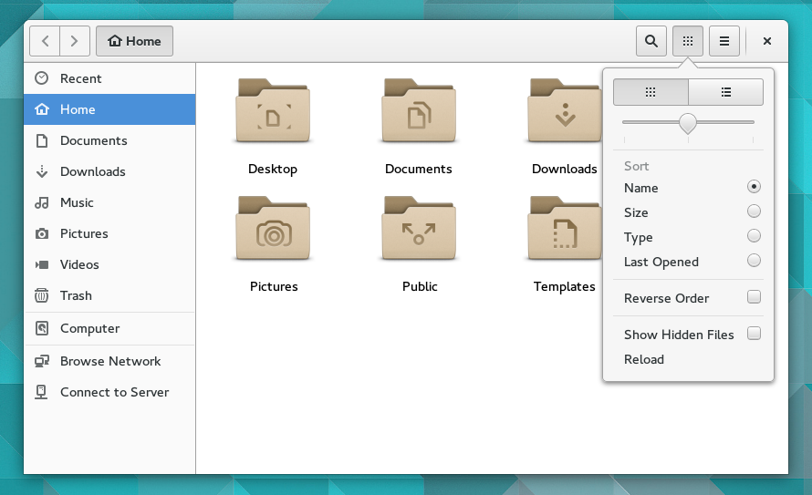
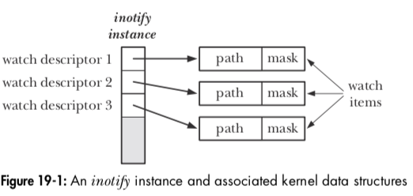
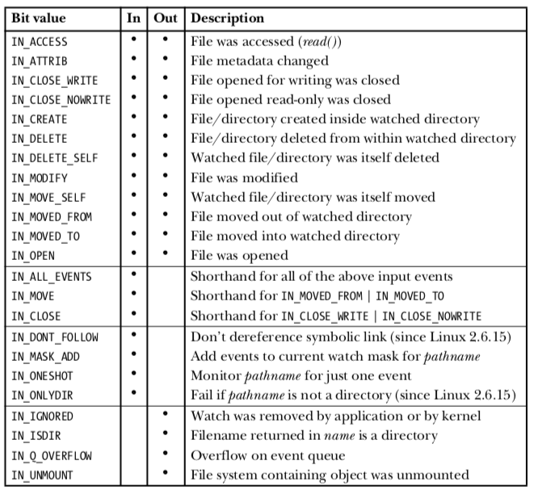
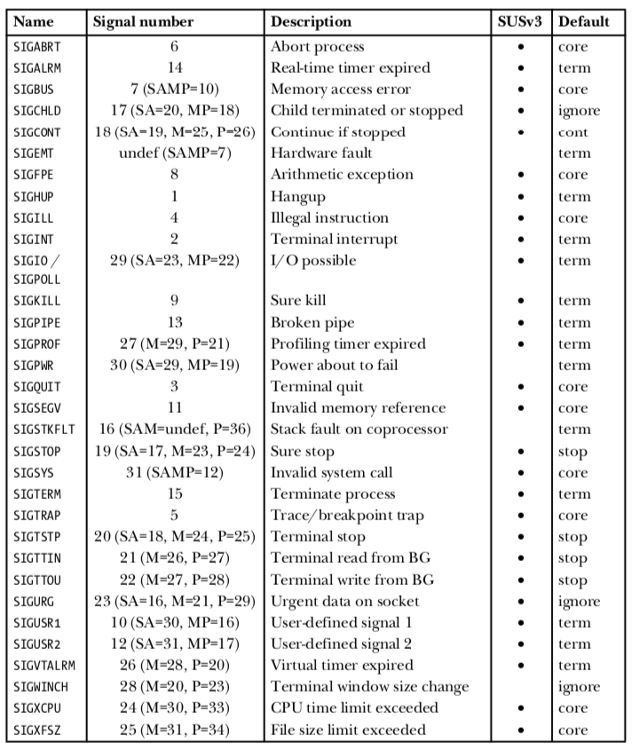
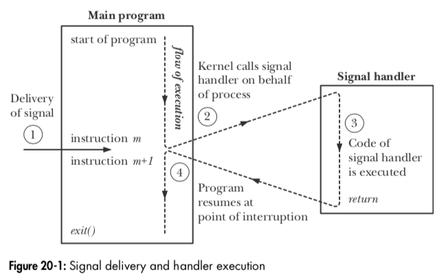

# **Events and Signals**
## Hey, you there?

https://talks.obedmr.com/


---

# Events

An **event** can be defined as a situation or occurence that is being
recognized by a program. An **event** will occur by one or multiple
actions that happened in the execution of the program.

- Event's handling will depend on each program flow and logic.
- An event can be generated by a signal.
- Events can cause new signals.
- [Event-Driven](https://en.wikipedia.org/wiki/Event-driven_programming) architecture and development comes from this basic concept.


---

# File Events

Some applications will require the ability to monitor files or directories in order to determine an event have occured in the specific monitored objects.


---
# Example: A graphical file manager

A graphical file manager needs to be able to determine when files are added or removed from the directory that is currently being displayed, or a daemon may want to monitor its configuration file in order to know if the file has been changed.




---

# `inotify` API: steps

1. Application calls `inotify_init()` to create an _inotify_ *instance*.

2. The application informs the kernel about which files are of interest by using the `inotify_add_watch()`




---

3. In order to obtain event notifications, the application performs `read()` operations on the `inotify` file descriptor.

4. When the application has finished monitoring, it closes the `inotify` file descriptor.


---

# `inotify` API: events




---

# The inotify API: reading events

After events have occurred, each read() returns a buffer.

```
 struct inotify_event {
 	int      wd;       /* Watch descriptor */
 	uint32_t mask;     /* Mask describing event */
 	uint32_t cookie;   /* Unique cookie associating related events (for rename()) */
 	uint32_t len;      /* Size of name field */
 	char     name[];   /* Optional null-terminated name */
 };
```

Source Code: `inotify/demo_inotify.c` from [TLPI](http://man7.org/tlpi/code/).


---

**In a `terminal 1`, run:**

```
 mkdir dir1 dir2
 ./demo_inotify dir1 dir2

```

**In `terminal 2`, run:**

```
 echo "Hello World" > dir1/aaa
 mv dir1/aaa dir2/bbb
 mkdir dir2/ddd
 rmdir dir1
```

- What's happening on `terminal 1`?


---

# Let's Code: File/Directory Monitor

- Follow instructions from:

https://github.com/CodersSquad/c-file-monitor


---

# Signals

A **signal** is a notification to a process that an event has occurred. Signals are sometimes described as *software* *interrupts*.

The usual source of many signals sent to a process is the kernel.


---

Below the types of events that cause the kernel to generate a signal:

- A **hardware exeption** occured
  _Examples:_ marformed machine-language instruction, dividing by 0, inaccessible memory referencing.

- The user typed one of the **terminal special character**
  _Examples:_ `Control-C`, `Control-Z`
- A **software event** ocurred
  _Examples:_ terminal windows was resized, timer went off, CPU limits or child process is terminated.


---

# Process' actions on signal

Depending on the signal, a process may act different:

- The signal is _ignored_.

- The process is _terminated_ (killed).

- A _core_ _dump_ file is generated.

- The process is _stopped_.

- Execution of the process is _resumed_ after previously being stopped.


---

**Alternatively,** a program may change the default behavior (also known as *disposition*) by:

- Allowing _default_ _action_ occur.

- The signal is _ignored_.

- A *signal* *handler* is executed.


---

# Signal types and default actions




---

# Signal Handlers
## (Signal dispositions)

A **signal handler** (also known as _signal_ _catcher_) is a function, written by the programmer, that performs appropriate tasks in response to the delivery of a signal. 




---

```
 #include <signal.h>
 static void sigHandler(int sig) {
    printf("Ouch!\n");   /* UNSAFE (see Section 21.1.2) */
}

 int main(int argc, char *argv[]) {
   int j;

  if (signal(SIGINT, sigHandler) == SIG_ERR) errExit("signal");
    for (j = 0; ; j++) {
        printf("%d\n", j);
        sleep(3);
    }
 }
```

Source Code: `signals/ouch.c` and `signals/intquit.c` from [TLPI](http://man7.org/tlpi/code/).


---

# Sending Signals

- `int kill(pid_t pid, int sig)`
One process can send a signal to another process using the kill() system call, which is the analog of the kill shell command.

- `int raise(int sig)`
Sometimes, it is useful for a process to send a signal to itself.

- In a single-threaded program, a call to `raise()` is equivalent to the following call to `kill()`

  `kill(getpid(), sig)`


---

- `int killpg(pid_t pgrp, int sig);`
The `killpg()` function sends a signal to all of the members of a process group.

Source Code: `signals/t_kill.c` from [TLPI](http://man7.org/tlpi/code/).


---

# Resources and Credits

This material is generated thanks to some extracts from following resources:

- The C Programming Language - _Brian_ _W._ _Kernighan_
- The Linux Programming Interface (Chapters 19, 20, 21, 22) - _Michael Kerrisk_
- [Signal Handling](https://www.gnu.org/software/libc/manual/html_node/Signal-Handling.html) from _GNU Project Documentation_


---

# Thanks

- **Obed N Muñoz Reynoso**
	- Cloud Software Engineer
	- obed.n.munoz@``gmail | tec | intel``.com