# **Operating System Architecture**
## An Introduction to UNIX/Linux

https://talks.obedmr.com/

---

# A bit of UNIX/Linux History

- First **UNIX** implementation was developed in 1969 at Bell Labs by Ken Thompson.
- Later, **C** programming language by Dennis Ritchie and Ken Thompson
- **BSD** and System V
- **Linux** and the **GNU** Project
- **Minix** by Andrew Tanenbaum


---

# The Linux Kernel

```
 Do you pine for the nice days of Minix-1.1, when men were men
 and wrote their own device drivers? Are you without a nice
 project and just dying to cut your teeth on a OS you can try to
 modify for your needs? Are you finding it frustrating when
 everything works on Minix? No more all-nighters to get a nifty
 program working? Then this post might be just for you. As I
 mentioned a month ago, I’m working on a free version of a
 Minix-look-alike for AT-386 computers. It has finally reached the
 stage where it’s even usable (though may not be depending on
 what you want), and I am willing to put out the sources for wider
 distribution. It is just version 0.02 . . . but I’ve successfully run
 bash, gcc, gnu-make, gnu-sed, compress, etc. under it
```

**Linus Torvals** - _1991_


---

# File System (Devices)

A **device special file** corresponts to a device on the system.

A **device driver** is a unit of kernel code that implements a set of operations that correspond to input and output actions on an associated device.

Devices can be divided in 2 types:

- **Character devices** - data on character-by-character basis. Terminals and keyboards.
- **Block devices** - data as block at a time. Disks and tape drives.


---

# File System (disks and partitions)

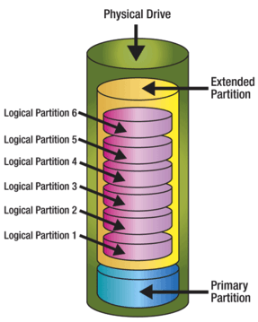


---

# File System (structure)

A file system is an organized collection of regular files and directories. Some examples of filesystem are:

- ext2, ext3, ext4, **brtfs**
- Microsoft's FAT, FAT32, NTFS
- Apple's HFS

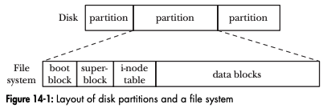


---

# ext2

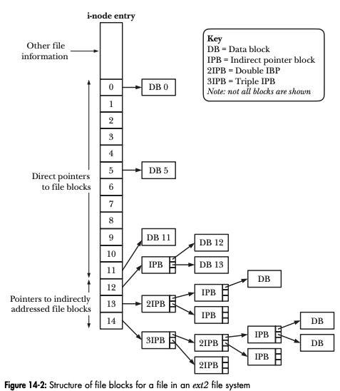


---

# File System (File descriptors)

When **openning** files for write, you'll create or discard previous contents. The system requires to do some validations to verify that you have the proper rigthts to do so.

A **File descriptor** is a non-negative integer that is used as a reference to the file you're working with.

All information about the `file` is maintained by the operating system. User will only access it through the file descriptor.


---

# Input / Output

All system calls for performing I/O refer to open files using a file descriptor, a (usually
small) nonnegative integer.

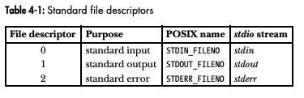


---

The following are the key required system calls for I/O operations.

```
 fd = open(name, flags, mode)
 numread = read(fd, buffer, count)
 numwritten = write(fd, buffer, count)
 status = close(fd)
```

Source Code: `fileio/copy.c` from [TLPI](http://man7.org/tlpi/code/).


---

# Input / Output (Universality)

Same `open()`, `read()`, `write()` and `close()` are used to perform I/O in all types of files, including devices.

```
 $ ./copy test test.old         # Copy a regular file
 $ ./copy a.txt /dev/tty        # Copy a regular file to this terminal
 $ ./copy /dev/tty b.txt        # Copy input from this terminal to a regular file
 $ ./copy /dev/pts/16 /dev/tty  # Copy input from another terminal
```

---

# System Calls
The UNIX-based operating systems provide their services through a set of **system calls**,
which will be function within the Operating System where the programs are running.

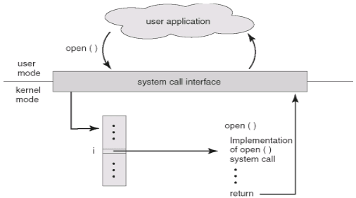


---

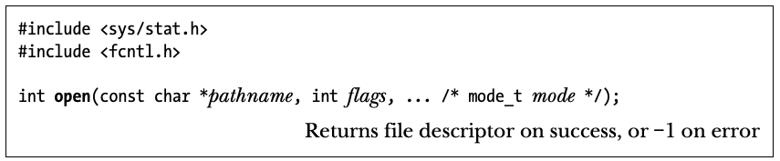

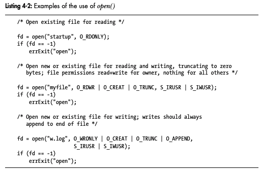


---

- What are the difference between `open` and `create`?
**go to:** https://linux.die.net/man/2/creat

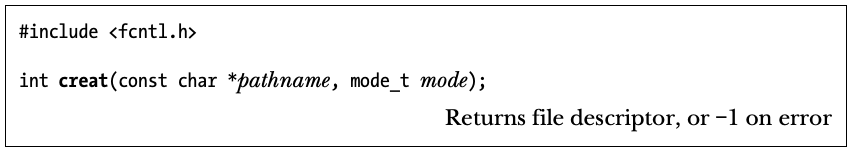


---

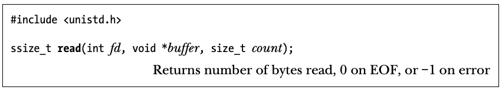
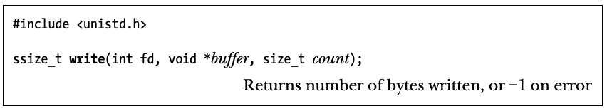


---

```
int main(int argc, char *argv[])
{
    int f1, f2, n;
    char buf[BUFSIZ];

    if (argc != 3)
	error("usage: cp from to");
    if ((f1 = open(argv[1], O_RDONLY, 0)) == -1)
	error("cp: can't open %s", argv[1]);
    if ((f2 = creat(argv[2], PERMS)) == -1)
	error("cp: can't create %s, mode %03o", argv[2], PERMS);

    while ((n = read(f1, buf, BUFSIZ)) > 0)
	if (write(f2, buf, n) != n)
	    error("cp: write error on file %s", argv[2]);
...
```

Source code [`cp.c`](src/cp.c) and [`syscalls.h`](src/syscalls.h)


---

# I/O System Calls - close and unlink

There's a limit (default 1024) on the number of opened files in a program. In order to open more, a program should be able to re-use file descriptors.

- `close(int` `fd)`
**breaks** the **connection** between the file descriptor and the opened file. `exit` function call or `return` in a program will close all files.

- `unlink(char` `*name)`
*removes* the *file* `name` from the filesystem.


---

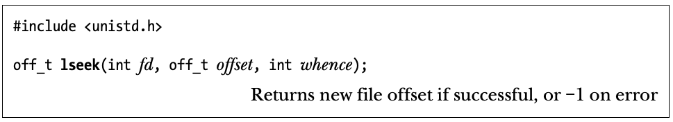

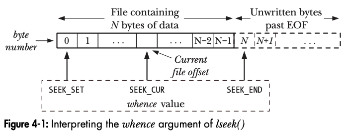

Source Code: `fileio/seek_io.c` from [TLPI](http://man7.org/tlpi/code/).


---

# Programs and Processes

A **process** is an instance pf an executing program.

A **program** is a file containing a range of information that describes how to contruct a process at run time. Information includes:

```
- Machine language instructions
- Programing entry-point address
- Data
- Symbol and relocation tables
- Shared-library and dynamic-linking information
- Other information
```

---

# Typical Program's memory layout

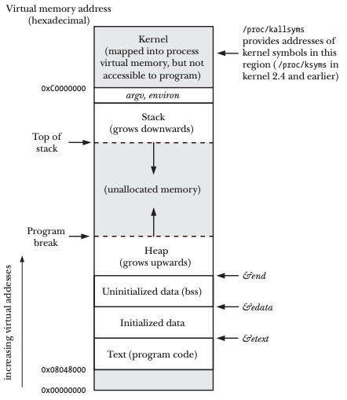


---

# Processes in Linux

- `htop`

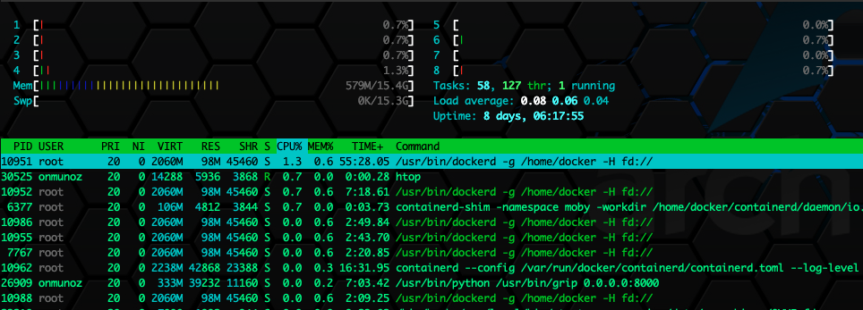


---

# Errors Handling

The manual page for each system call documents the possible return values of the call, showing which value(s) indicate an error.

```
 fd = open(pathname, flags, mode); /* system call to open a file */
 if (fd == -1) {
    /* Code to handle the error */
 }
 ...
 if (close(fd) == -1) {
    /* Code to handle the error */
 }
```


---

# Errors reporting functions

- `perror` - `#include <stdio.h>`

```
 fd = open(pathname, flags, mode);
 if (fd == -1) {
     perror("open");
     exit(EXIT_FAILURE);
 }
```

- `strerror` - `#include <string.h>`

```
 char *strerror(int errnum); // Returns pointer to error string corresponding to errnum
```


---

# Signals
A **signal** is a notification to a process that an event has occurred. Signals are sometimes described as **software interrupts**.

Signals may occur when:

- A hardware exception occured
- The user typed one of the terminal special characters (i.e. `Control-C`, `Control-Z`)
- A software event occurred


Source Code: `signals/ouch.c` and `signals/intquit.c` from [TLPI](http://man7.org/tlpi/code/).


---

# Let's Code: mycat

https://github.com/CodersSquad/c-my-cat


---

# Resources and Credits
This material is generated thanks to some extracts from following resources:

- The C Programming Language - _Brian W. Kernighan_
- The Linux Programming Interface - _Michael Kerrisk_

---

# Thanks

- **Obed N Muñoz Reynoso**
	- Cloud Software Engineer
	- obed.n.munoz@``gmail | tec | intel``.com
