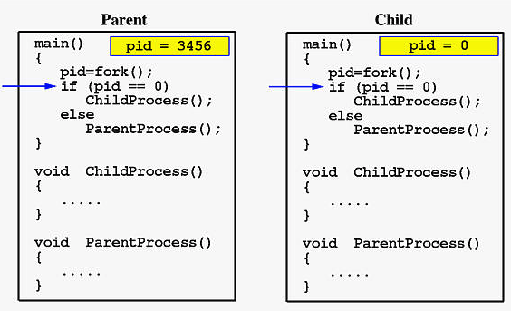
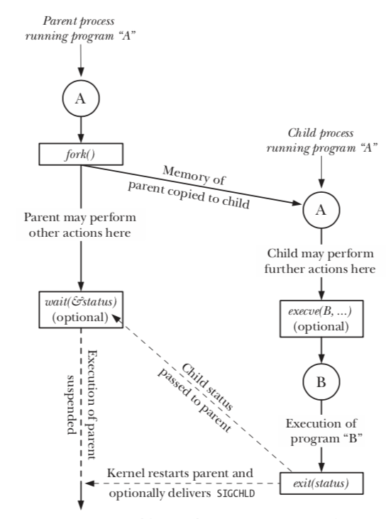
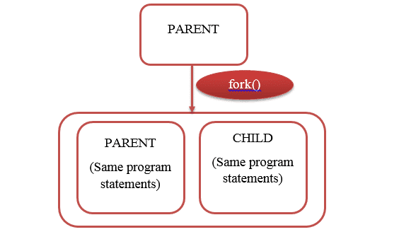
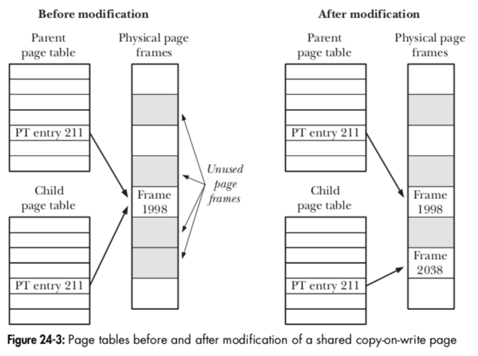
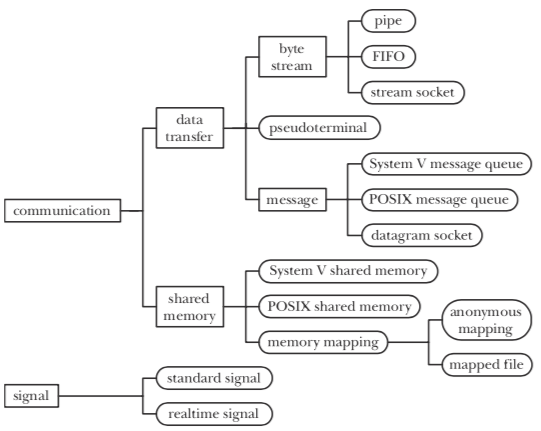
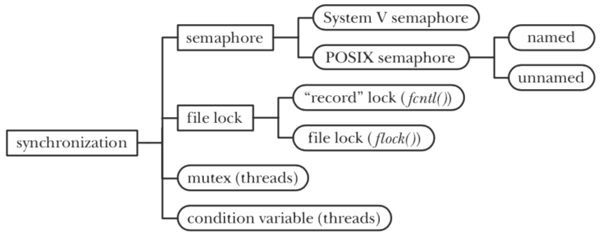

# **Processes Management**
## Who's first?

https://talks.obedmr.com/


---

# Process Context

- Each time a process is removed from access to the processor, sufficient information on its current operating state must be stored such that when it is again scheduled to run on the processor it can resume its operation from an identical position.

- This operational state data is known as its *context* and the act of removing the process's thread of execution from the processor (and replacing it with another) is known as a process switch or **context switch**.


---

## Process management system calls

- `fork()`
- `exit()`
- `wait()`
- `execve()`




---

## Overview of `fork()`, `exit()`, `wait()` and `execve()`



---

## Create a new process - `fork()`

The `fork()` system call creates a new process; the **child**, which is an almost exact duplicate of the calling process, the **parent**.

The two processes are executing the same program text, but they have separate copies of the stack, data, and heap segments.


---

```
 pid_t childPid; /* Used in parent to record PID of child */

 switch (childPid = fork()) {
   case -1:
     /* fork() failed */
     /* Handle error */
   case 0:
     /* Child of successful fork() comes here */
     /* Perform actions specific to child */
   default:
     /* Performs actions specific to parent */
```

Source Code: `procexec/t_fork.c` from [TLPI](http://man7.org/tlpi/code/).


---

# Memory Semantics of `fork()`

Conceptually, we can consider `fork()` as creating copies of the parent’s _text_, _data_, _heap_, and `stack` segments. It would be wasteful in many cases.



---

Most modern UNIX implementations, including Linux, use two techniques to avoid such wasteful copying:

- The kernel marks the **text segment** of each process **read-only**, so that a process can’t modify its own code. With a **per-process page-table** that points to the same virtual memory pages in parent.

- **copy-on-write** technique. After the `fork()`, the kernel traps any attempts by either the parent or the child to modify one of these pages, and makes *a* *duplicate* copy of the *about-to-be-modified* *page*.


---




---

## Race Conditions after `fork()`

It is indeterminate which process the parent or the child next statement has access to the CPU. In a complex system, this kind of issues or bugs can be hard to find.

Source Code: `procexec/fork_whos_on_first.c` from [TLPI](http://man7.org/tlpi/code/)


---

## Let's test:

```
 for i in $(seq 1 1 1000); do ./fork_whos_on_first 1; done | ./fork_whos_on_first.count.awk
 for i in $(seq 1 1 1000); do ./fork_whos_on_first 5; done | ./fork_whos_on_first.count.awk
 for i in $(seq 1 1 1000); do ./fork_whos_on_first 10; done | ./fork_whos_on_first.count.awk
```

- How we can avoid those race conditions?

- What if I want concurrent childs but I want some order in the execution?

- Can I wait for a specific child in order to continue in the parent process?


---

# Process termination

There are 2 general ways for terminating a process.

- _Abnormal_ termination (with our without core dump)
- _Normal_ termination using the `_exit()` system call

```
 #include <unistd.h>
 void _exit(int status);
```


---

`exit()` is generally used because it provides extra functionality.

```
 #include <stdlib.h>
 void exit(int status);
```

The following actions are performed  by `exit()`:
- Exit handlers
- `stdio` stream buffers are flushed
- The `_exit()` system call is invoked with the provided `status` code.


---

# Exit handlers

Sometimes, an application needs to automatically perform some operations on process termination.

```
 #include <stdlib.h>
 int atexit(void (*func)(void));  /* Returns 0 on success, or nonzero on error */
```

In case you need the exit status code, there's a nonstandard alternative provided by `glibc`

```
 #define _BSD_SOURCE /* Or: #define _SVID_SOURCE */
 #include <stdlib.h>
 int on_exit(void (*func)(int, void *), void *arg); /* Returns 0 on success, or nonzero on error */
```


---

The `func` argument is a pointer to a function as follows:

```
 void func(int status, void *arg) {
   /* Perform cleanup actions */
 }
```

Source Code: `procexec/exit_handlers.c` from [TLPI](http://man7.org/tlpi/code/)


---

## Daemons and Services

A **daemon** is a process with the following characteristics:

```
- It's long-lived
- It runs in the background and has no controlling terminal
- Can run either as privileged or non-provileged user
```

Examples of common services:

```
- sshd
- httpd
- nginx
- mariadb
```

---

## Let's think about it:

- What are the considerations we need to have when running our programs as daemons?
  - Consider that they are started in an automated way, you don't know the exact time when they start
```
-
-
-
-
```

- Who is responsible for stating the `daemon` or `service`?


---

# Systemd

- Is a set of utilities that are used in place of sysVunit to manage services, including startup and shutdown.

- Uses `Targets` and `Service Groups` to allow a Linux system to be brought to any defined state.

- Developed by RedHat, and is currently a _de-facto_ requirement for Gnome. Below some interactions with `systemd`.

```
 systemctl status
 systemctl list-units
 journalctl -f
 systemctl status <service>
```

---

# Let's code: Logging to syslog

- Follow instructions from:

https://github.com/CodersSquad/c-syslog


---

## Communication between Processes

An overview of Inter-process communication alternatives.



**Note:** we'll go deeper on IPC in the following chapters.


---

## Synchronization between processes




---

# Processes' priority and relationship

Read Chapter 35 from _The Linux Programming Interface_ book and explain the following concept in your own words:

- Process Priorities (Nice Values)
- Realtime Process Scheduling
- Realtime Process Scheduling API
- CPU Affinity

Run the `procpri/*` from the [TLPI](http://man7.org/tlpi/code/) code examples and comment about in your report.


---

# Resources and Credits
This material is genereated thanks to some extracts from following resources:

- The C Programming Language - _Brian W. Kernighan_
- The Linux Programming Interface (Chapters 24, 25, 27, 36, 37, 43) - _Michael Kerrisk_
- [The Linux Documentation Project](http://www.tldp.org/LDP/LG/issue23/flower/context.html)
- [A Brief Introduction to Systemd](https://www.accs.com/p_and_p/Systemd/Systemd.pdf)


---

# Thanks

- **Obed N Muñoz Reynoso**
	- Cloud Software Engineer
	- obed.n.munoz@``gmail | tec | intel``.com
