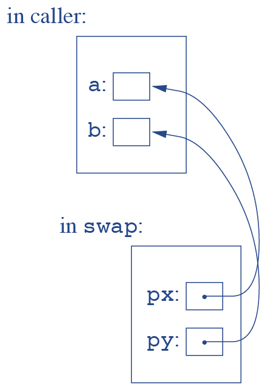
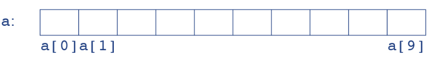
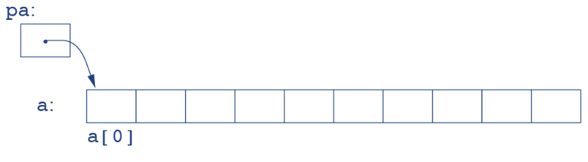
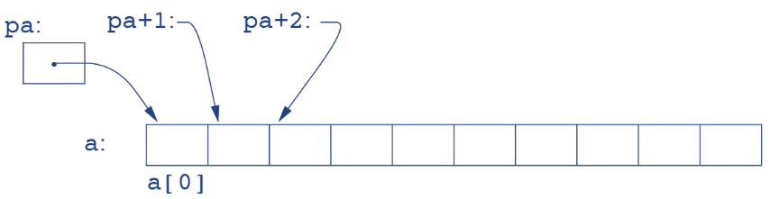
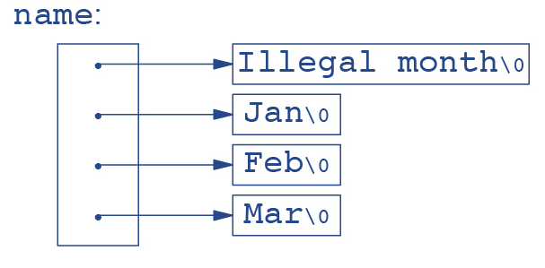
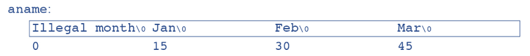

# **Pointers and Structures in C**
## Where all the fun starts

https://talks.obedmr.com/

---

# Pointer
A pointer is a variable that contains the address of a variable.


```
int x = 1, y = 2, z[10];
int *ip;         /* ip is a pointer to int */
ip = &x;         /* ip now points to x */
y = *ip;         /* y is now 1 */
*ip = 0;         /* x is now 0 */
ip = &z[0];      /* ip now points to z[0] */
```


---

# Pointers in Functions

- Arguments by value

```
void swap(int x, int y)
{
   int temp;
   temp = x;
   x = y;
   y = temp;
}
```

---

- Arguments by reference

```
void swap(int *px, int *py)
{
    int temp;
    temp = *px;
    *px = *py;
    *py = temp;
}
```

So, what would be used in the `main` function?




---

# Arrays and Pointers

```
int a[10];
int *pa;
```

What's the output of the following code?

```
a[1] = 132;
pa = a;
printf("%d\n", pa);
```

How to fix it?

---

```
int a[10]; // Defines an array of 10 elements
```



```
int *pa;
pa = &a[0];
```




---

How to access `a`'s  elements from `*pa`



Then,

```
*pa == a[0]
*(pa + 1) == a[1]
*(pa + 2) == a[2]
*(pa + n) == a[n]
```


---

# Multi-dimensional arrays

```
static char daytab[2][13] = {
    {0, 31, 28, 31, 30, 31, 30, 31, 31, 30, 31, 30, 31},
    {0, 31, 29, 31, 30, 31, 30, 31, 31, 30, 31, 30, 31}
};


int day_of_year(int year, int month, int day)
{
    int i, leap;
    leap = year%4 == 0 && year%100 != 0 ¦¦ year%400 == 0;

    for (i = 1; i < month; i++)
        day += daytab[leap][i];
    return day;
}
```

---

# Let's code: month day calculator

- Add the proper error checking mechanisms

- Implement `month_day` function that given a year and a year day, calculate the corresponding month and the month's day numbers. Use pointers for month and month's day.

```
/* month_day function's prototype*/
void month_day(int year, int yearday, int *pmonth, int *pday);
```
- Follow instructions from:
https://github.com/CodersSquad/c-month-day


---

# Pointer Arrays

```
char *month_name(int n) {

   static char *name[] = {
       "Illegal month",
       "January", "February", "March",
       "April", "May", "June",
       "July", "August", "September",
       "October", "November", "December"
   };

 return (n < 1 ¦¦ n > 12) ? name[0] : name[n];
}
```

**Question:** How's the string's lenght being defined?

---

# Pointers vs. multi-dimensional arrays

- Multi-dimensional array

```
 int a[10][20];
```

- Pointer array
```
 int *b[10];
```

**Question:** What's the difference between `a` and `b`?


---


- Pointer array

```
char *name[] = { "Illegal month", "Jan, "Feb", "Mar" };
```




---

- Multi-dimensional array

```
char aname[][15] = { "Illegal month", "Jan", "Feb", "Mar" };
```




**Questions:**
- Which one is using more memory? `name` or `aname`?
- How strings size are being calucated in `name` pointer array?
- Remember `argv`? what is it?

---

# Pointers to functions

```
void qsort(void *lineptr[], int left, int right,
           int (*comp)(void *, void *));
```

**Questions:**
- What is `*lineptr[]`?
- What is `int  (*comp)(void *, void *)`?
- What `void *` means?

---

# Let's code: Generic Merge Sort

- Follow instructions from:
https://github.com/CodersSquad/c-generic-mergesort


---

# More about Structures ...
Read the **Chapter 6 - Structures** in
the [The C Programming Language](https://www.amazon.com/Programming-Language-2nd-Brian-Kernighan/dp/0131103628) book.

- Declaration of structures
- Usage in function and as parameters
- Arrays of structures
- Self-referencing
- Pointers to structures
- Table lookup (Hash tables)


---

# Resources and Credits
This material is generated thanks to some extracts from following resources:

- *The* *C* *Programming* *Language* (Chapters 5,6) - _Brian_ _W._ _Kernighan_


---

# Thanks

- **Obed N Muñoz Reynoso**
	- Cloud Software Engineer
	- obed.n.munoz@``gmail | tec | intel``.com
