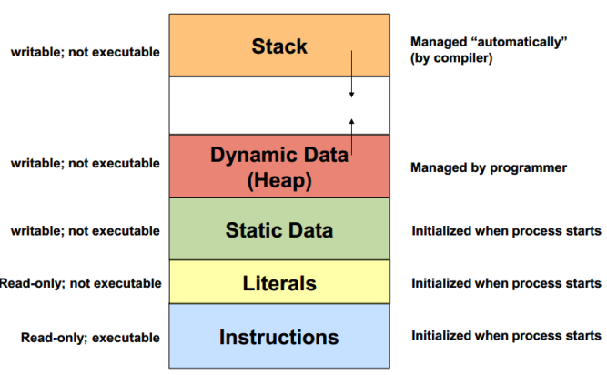

# **Memory Management in C**
## mmm, segmentation fault?

https://talks.obedmr.com/

---


# Program's memory Layout




---

# Dynamic Memory Allocation
The process of allocating memory space aton run time.

C offers a set of functions for dynamic memory allocation.

```
- malloc    // allocates size bytes of memory and returns a pointer to the allocated memory
- realloc   // tries to change the size of the allocation pointed to by ptr to size
- calloc    // allocates the specified number of bytes and initializes them to zero
- free      // releases the specified block of memory back to the system
```

**Tip:** *Use the `man` command to get details on each function*

---


# Pointers, let's say ...

```
char *p; // 4 consecutive bytes in memory for the p variable

char *p = NULL;
strcpy(p, "Hello");

// Result
Segmentation Fault. Worse yet, the copy may actually succeed.
```

Trying to copy the string `"Hello"` into location `0` (`NULL`) results in a run-time Bus Error and a program crash.

Source Code: [no-malloc.c](./src/02/no-malloc.c)

---


# Proper memory allocation

We can use `malloc` or `calloc` to request a pointer to a block of memory. Run `man` on both functions for details.

```
char *q = NULL;
// Memory allocation
q = (char *)malloc(strlen("Goodbye")+1);

// Copying string to memory
strcpy(q, "Goodbye");

printf("%s\n", q);
```

Source Code: [malloc.c](./src/02/malloc.c)


---

# Successful allocation?


```
char *q = NULL;

q = (char *)malloc(strlen("Goodbye")+1);

// Proper allocate validation
if (!q) {
    perror("Failed to allocate space because");
    exit(1);
}
```

Source Code: [malloc2.c](./src/02/malloc2.c)

---

# Now, scope in memory allocation

Local variables are destroyed when their enclosing function terminates. Run the following code and verify the output.

Open the source code link to verify the `foo` function.

```
char *a = NULL;
char *b = NULL;

a = foo("Hi there, Chris");
b = foo("Goodbye");
printf("From main: %s %s\n", a, b);
```

Source Code: [no-free.c](./src/02/no-free.c)

---

**The address of `q` is returned to `main`, where there is an attempt to preserve and use the strings. The result can be disastrous.**

Consider this `foo` function version

```
char *foo(char *p) {
    char *q = (char *)malloc(strlen(p)+1);
    strcpy(q, p);
    printf("From foo: the string is %s\n", q);
    return q;
}
```

Is the output right? What's the difference against the  [no-free.c](./src/02/no-free.c)?

Source Code: [no-free2.c](./src/02/no-free2.c)


---

# You should `free` the memory

```
char *a = NULL;
char *b = NULL;

a = foo("Hi there, Chris");
free(a);
b = foo("Goodbye");
free(b);
printf("From main: %s %s\n", a, b);
```

What's the output? is this the expected behaviour?

Source code: [free.c](src/02/free.c)


---

# Resources and Credits
This material is generated thanks to some extracts from following resources:

- The C Programming Language - _Brian_ _W._ _Kernighan_
- [Memory Management](http://staff.um.edu.mt/csta1/courses/lectures/csa2060/c8a.html) - _University_ _of_ _Malta_


---

# Thanks

- **Obed N Muñoz Reynoso**
	- Cloud Software Engineer
	- obed.n.munoz@``gmail | tec | intel``.com
